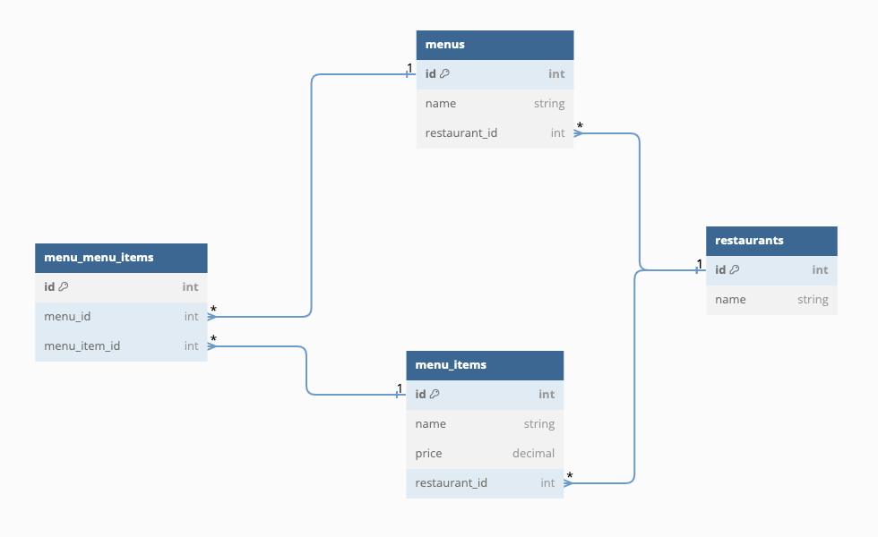
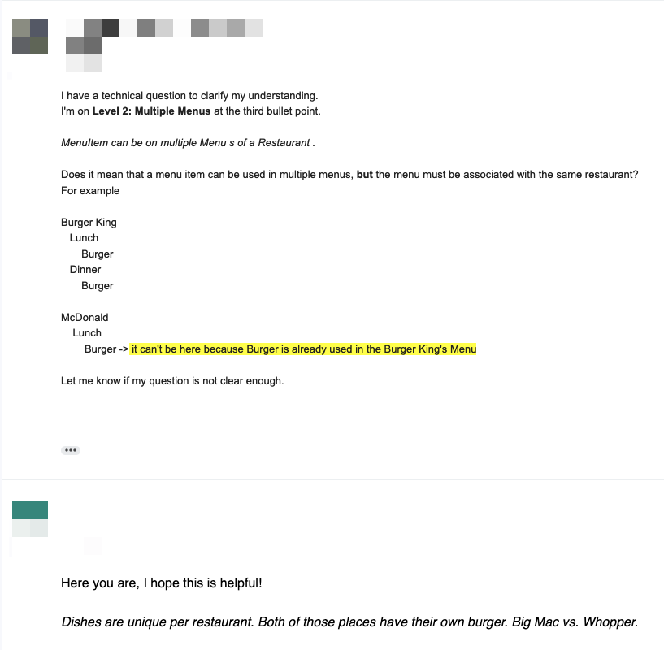
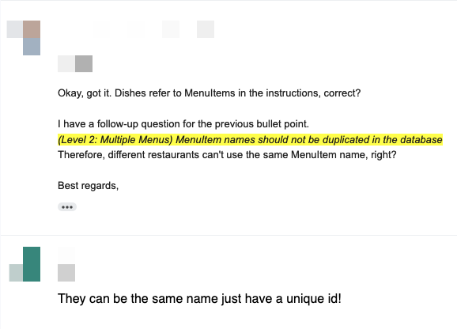

# README

## How to Run Testing
```
rails spec
```

## How to Run Conversion Tool

1. Go to terminal
2. Run Rails Console

```
rails console
```

3. Copy Paste this command to Rails Console

```
load "conversion_tool_script.rb"
```

## Database Design

[Link](https://dbdiagram.io/d/PopMenu-62e80172f31da965e856be83)


## Folow-up Questions

**First Question**



**Second Question**

